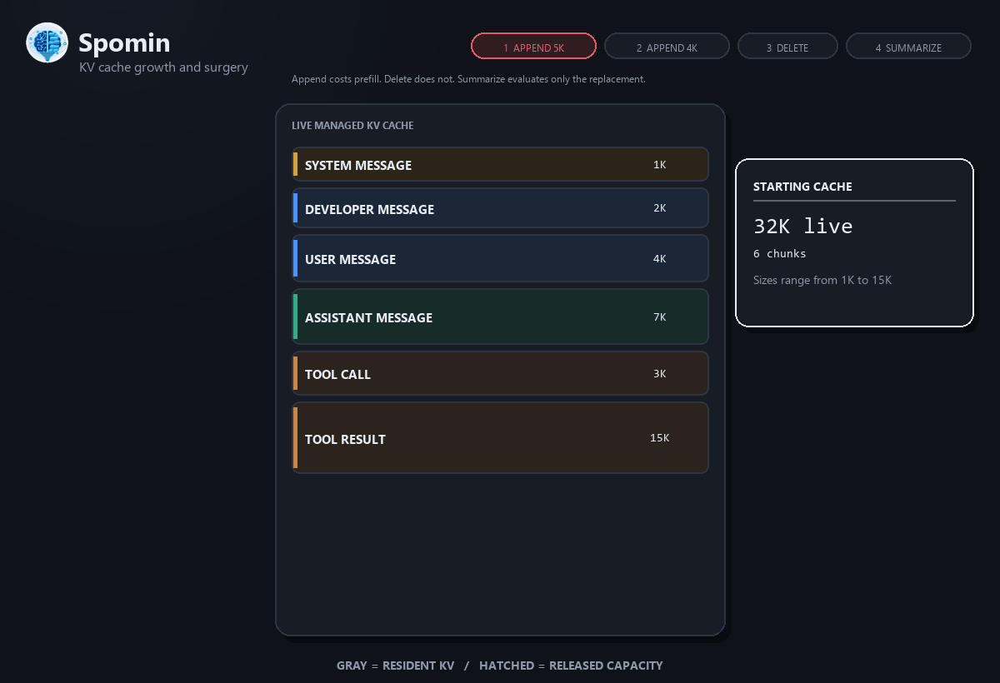

# llama.cpp KV surgery fork

> [!WARNING]
> This experimental fork provides the managed KV runtime used by Spomin with Qwen3.8-27B and DFlash2. It supports coordinated target/draft edits and position compaction. See the [runtime synchronization record](docs/spomin-runtime-sync.md) for source provenance and verification.

This repository is a focused fork of [ggml-org/llama.cpp](https://github.com/ggml-org/llama.cpp). See the upstream project for general llama.cpp documentation and normal OpenAI-compatible server usage.

## What it does

**In simple terms:** A router can delete an old chunk or replace a large old chunk with a short summary, reclaim the removed attention KV-cache cells, and keep generating without re-prefilling the retained suffix.

**Technically:** The fork adds revision-checked, token-only managed-slot endpoints to `llama-server` for in-place KV range edits, appends, and continuation. Non-compacting replacements preserve retained positions; a separate hole-compaction operation shifts target and supported draft positions together. Replacement or summary token IDs are the only tokens decoded during an edit; the retained suffix stays frozen, while later tail tokens can reuse the released attention-KV capacity.

One initial cache fill is still required. "No re-prefill" means an edit does not decode the already-cached suffix again.



## Compatibility and limitations

| Component | Status |
| --- | --- |
| Qwen 3.6 27B | Managed KV surgery has been validated with this target |
| Qwen3.8-27B | Current Spomin target; live integration covered replacement, compaction, append, and draft generation |
| DFlash | Supported by the current base; the original managed-DFlash validation used Qwen 3.6 27B |
| DFlash2 | Coordinated target/draft range edits and hole compaction preserve coherent draft continuation; tensor-split selector support included |
| DSpark | Shares the implemented dual-edit/compaction path; separate model-specific validation is required |
| MTP | Not supported after an interior KV edit |

On hybrid Qwen models, recurrent state is preserved rather than recomputed. Interior edits are therefore approximate, and removed content may still influence later output.

A purpose-built router must own the slot, exact token IDs, absolute ranges, managed revision, and all later appends. The Spomin router implements this lifecycle. Its harness must disable automatic and manual compaction and preserve one session identity. This experimental managed-slot API remains intentionally separate from ordinary OpenAI-compatible completion requests.

Managed text and image operations use separate token-cell and causal-position coordinates. Vision requires a matching projector and advertised capabilities; see [managed vision](docs/managed-vision.md). Never cut a generic text edit through an image span.

Managed slots also disable ordinary context shifting. Generation stops at the live cache limit instead of compacting router-owned absolute positions; the router must delete, summarize, or rebuild to create capacity.

## Requirements

- CMake and a C++ compiler supported by upstream llama.cpp.
- A supported target GGUF model. The current Spomin deployment uses Qwen3.8-27B Q8_0.
- Optionally, a matching DFlash or DFlash2 GGUF sidecar.
- A writable slot-save directory. Managed slot actions are disabled without `--slot-save-path`.
- Enough CPU RAM or VRAM for the selected model and KV-cache configuration.

CUDA is optional. Replace `GGML_CUDA` with the backend appropriate for your machine.

For Windows CUDA builds, install Visual Studio 2022 Build Tools with the C++ workload, CMake, Git, and a CUDA toolkit supported by upstream llama.cpp. On Linux, install Git, CMake, Python 3, and your compiler/backend toolchain.

## Clone and build

```sh
git clone --branch experimental/kv-surgery-dflash https://github.com/alekk89/llama.cpp-kv-surgical-fork.git
cd llama.cpp-kv-surgical-fork
cmake -S . -B build -DGGML_CUDA=ON -DLLAMA_BUILD_SERVER=ON
cmake --build build --config Release --target llama-server -j 8
```

The normal binary locations are:

- Windows multi-config build: `build\bin\Release\llama-server.exe`
- Linux or macOS single-config build: `build/bin/llama-server`

## Start the server

Create a writable slot directory and start one fixed slot. The examples use a 12,288-token context because that is the validated capacity-test configuration.

### Windows PowerShell with DFlash or DFlash2

```powershell
New-Item -ItemType Directory -Force .\tmp\slots | Out-Null
.\build\bin\Release\llama-server.exe `
  -m C:\models\Qwen3.8-27B-Q8_0.gguf `
  -md C:\models\Qwen3.8-27B-DFlash2-Q4_K_M.gguf `
  --spec-type draft-dflash `
  --spec-draft-n-max 15 `
  --ctx-size 12288 `
  --parallel 1 `
  --slot-save-path .\tmp\slots `
  --slots `
  --no-webui `
  -fa on `
  -ngl 999
```

### Linux or macOS without a draft sidecar

```sh
mkdir -p ./tmp/slots
./build/bin/llama-server \
  -m /models/Qwen3.8-27B-Q8_0.gguf \
  --ctx-size 12288 \
  --parallel 1 \
  --slot-save-path ./tmp/slots/ \
  --slots \
  --no-webui \
  -fa on \
  -ngl 999
```

Adjust model paths, GPU offload, context size, cache types, and DFlash or DFlash2 draft size for your hardware and sidecar. The draft type is detected from the sidecar metadata, and the draft size is clamped to its trained block size.

## Verify the fork API

The server defaults to `http://127.0.0.1:8080`. These examples use `curl`; use `curl.exe` in Windows PowerShell if `curl` resolves to `Invoke-WebRequest`.

```sh
curl -sS http://127.0.0.1:8080/props
curl -sS http://127.0.0.1:8080/slots
```

The `/props` response must contain a `managed_slot` object with `api_version: 1`, `edit: true`, `append: true`, and `native_completion: true`.

Each slot reports `managed_revision`, `managed_append_only`, `managed_draft_coherent`, and `managed_requires_rebuild`. A fresh slot starts at revision `0`.

Keep the server bound to localhost unless you have configured authentication and a trusted network boundary. The managed endpoints accept exact token IDs and mutate resident model state; they should not be exposed as a public API.

### Endpoint reference

| Endpoint | Purpose |
| --- | --- |
| `GET /props` | Discover managed-slot capabilities and server defaults |
| `GET /slots` | Inspect slot state and the current managed revision when `--slots` is enabled |
| `POST /tokenize` | Convert router text to exact target-model token IDs |
| `POST /detokenize` | Convert a token array back to text for diagnostics |
| `POST /slots/{id}?action=managed_native_prefill` | Fill an empty slot and enter the managed lifecycle without generation |
| `POST /slots/{id}?action=kv_edit` | Delete or replace one or more cached ranges |
| `POST /slots/{id}?action=kv_append` | Decode router-owned tokens at the logical tail without generation |
| `POST /slots/{id}?action=managed_native_completion` | Preferred append-and-generate path using the normal scheduler |
| `POST /slots/{id}?action=managed_generate` | Deprecated compatibility append-and-generate path |
| `POST /slots/{id}?action=erase` | Clear the slot before an authoritative rebuild |

## Managed-slot workflow

Set a base URL for the examples:

```sh
BASE=http://127.0.0.1:8080
```

In PowerShell, use `$BASE = "http://127.0.0.1:8080"` and replace `curl` with `curl.exe`.

### 1. Tokenize and track the exact prompt

Tokenize the complete initial router prompt once and persist the returned IDs. `add_special` should normally be true only for the initial prompt.

```sh
curl -sS -X POST "$BASE/tokenize" \
  -H "Content-Type: application/json" \
  -d '{"content":"Your complete initial router prompt","add_special":true,"parse_special":true}'
```

The response is:

```json
{
  "tokens": [151644, 8948, 198, 2610]
}
```

Record the absolute `[start_pos, end_pos)` token range for every removable router object. `start_pos` is inclusive and `end_pos` is exclusive.

### 2. Fill and claim the managed slot

Use `managed_native_prefill` to decode the initial token array without generating text. Replace the illustrative IDs with the complete array returned by `/tokenize`.

```sh
curl -sS -X POST "$BASE/slots/0?action=managed_native_prefill" \
  -H "Content-Type: application/json" \
  -d '{"expected_revision":0,"tokens":[151644,8948,198,2610]}'
```

Persist the returned `managed_revision`. Every successful managed mutation increments it.

You may instead bootstrap an empty slot with `managed_native_completion` when you want to fill the initial cache and generate in one request.

### 3. Delete a cached chunk

Delete a range by supplying an empty replacement token array. For Qwen, enable experimental attention-only mode. The examples leave holes first; a separate compaction closes them after replacement.

```sh
curl -sS -X POST "$BASE/slots/0?action=kv_edit" \
  -H "Content-Type: application/json" \
  -d '{
    "expected_revision":1,
    "experimental_attention_only":true,
    "compact_positions":false,
    "edits":[
      {"start_pos":1176,"end_pos":1243,"tokens":[]}
    ]
  }'
```

This releases the attention-KV cells in `[1176, 1243)`. The retained suffix stays at its original positions and is not re-prefilled.

### 4. Replace a cached chunk with a summary

The router creates the summary text outside llama.cpp, then tokenizes it without adding a new BOS token:

```sh
curl -sS -X POST "$BASE/tokenize" \
  -H "Content-Type: application/json" \
  -d '{"content":"[summary: seg0031, archived]: short summary","add_special":false,"parse_special":true}'
```

Insert the returned summary IDs at the old range start:

```sh
curl -sS -X POST "$BASE/slots/0?action=kv_edit" \
  -H "Content-Type: application/json" \
  -d '{
    "expected_revision":2,
    "experimental_attention_only":true,
    "compact_positions":false,
    "edits":[
      {"start_pos":1650,"end_pos":1706,"tokens":[101,202,303]}
    ]
  }'
```

The replacement must not be longer than the removed range. Unused positions become logical holes and their attention-KV cells are free.

Multiple edits may be sent in one request. They must be ordered, non-overlapping, within the cached attention range, and contain valid target-model token IDs.

### 5. Append tokens without generating

Use `kv_append` when the router only needs to decode new tail tokens. It returns `token_probe`, the greedy next-token probe after the append.

```sh
curl -sS -X POST "$BASE/slots/0?action=kv_append" \
  -H "Content-Type: application/json" \
  -d '{"expected_revision":3,"tokens":[606,707,808]}'
```

### 6. Append and continue with the normal scheduler

`managed_native_completion` is the preferred post-edit generation endpoint. It uses llama.cpp's normal scheduler while longest-prefix matching the position-aligned managed ledger, so it evaluates only the new tail rather than re-prefilling retained history.

```sh
curl -sS -X POST "$BASE/slots/0?action=managed_native_completion" \
  -H "Content-Type: application/json" \
  -d '{
    "expected_revision":4,
    "tokens":[606,707,808],
    "n_predict":128,
    "temperature":0.2,
    "stream":false
  }'
```

`n_predict` and sampling fields may be omitted to use the server defaults. Set `stream: true` for server-sent events named `managed_native_begin`, `managed_native_delta`, and `managed_native_final`, followed by `data: [DONE]`.

The final response includes the appended and generated counts, generated token IDs and text, absolute managed positions, `managed_revision`, `managed_append_only`, `managed_draft_coherent`, and `managed_requires_rebuild`.

### Compatibility generation endpoint

`managed_generate` is the deprecated explicit managed generator. It remains available for API compatibility, requires a positive `n_predict`, and supports streaming. New routers should use `managed_native_completion` because it uses the normal completion scheduler.

```sh
curl -sS -X POST "$BASE/slots/0?action=managed_generate" \
  -H "Content-Type: application/json" \
  -d '{
    "expected_revision":4,
    "tokens":[606,707,808],
    "n_predict":128,
    "temperature":0.2,
    "stream":false
  }'
```

### Continue generation without new input tokens

For the managed generation endpoints, send an empty token array with `continue_generation: true`:

```json
{
  "expected_revision": 5,
  "tokens": [],
  "continue_generation": true,
  "n_predict": 64
}
```

### Reset the slot

Erase the slot before rebuilding it from authoritative router state:

```sh
curl -sS -X POST "$BASE/slots/0?action=erase"
```

The erase response returns the new `managed_revision`. Rebuild from the router's exact token ledger after any failed dual edit or semantic recovery request. A revision mismatch is a rejected request and does not mutate the slot.

## Revision and ownership rules

- Always send the last acknowledged `managed_revision` as `expected_revision`.
- `expected_revision` is required for prefill, edit, append, and both managed generation actions.
- Commit router state only after receiving a successful response and its new revision.
- After any server-side mutation failure, inspect `/slots`. If `managed_requires_rebuild` is true, erase and rebuild from authoritative router state before sending another managed action.
- Keep exact tokenizer IDs and absolute ranges. Do not reconstruct edited ranges from decoded text.
- For draft-preserving position compaction, require `qwen_compact_positions` and `qwen_attention_only_dflash_dual_compact`, then check `managed_draft_coherent` in the acknowledgement.
- After surgery, do not send an ordinary `/completion` request against the slot.
- Do not use normal prompt-cache matching to continue an edited slot.
- Use a router rebuild when exact deletion semantics are required.
- Treat `managed_draft_coherent: false` as a prohibition on model-backed speculative continuation.
- Never use managed KV actions with an `mmproj` or multimodal slot.
- Do not treat the upstream `save` and `restore` slot actions as managed-surgery recovery. Rebuild from authoritative router state instead.

## Important response fields

| Field | Meaning |
| --- | --- |
| `managed_revision` | Monotonic concurrency guard for the router-owned slot |
| `managed_append_only` | The slot is under the managed lifecycle and ordinary completion is rejected |
| `managed_draft_coherent` | Target and supported draft companion mutations both succeeded |
| `managed_requires_rebuild` | A mutation failed after touching cache state; only erase or restore may recover the slot |
| `n_removed` / `n_inserted` | Source range size and replacement token count for `kv_edit` |
| `pos_min_after` / `pos_max_after` | Physical attention-cache position bounds after the edit |
| `pos_start` / `pos_end` | Absolute range used by an append or managed continuation |
| `token_probe` | Greedy next token after `kv_append` |

## Test the fork

Build `llama-server` first, then run the focused unit regression:

```sh
cd tools/server/tests
python -m pytest unit/test_slot_kv_edit.py -v
```

With a fresh Qwen server running at a 12,288-token context, run the capacity integration test:

```sh
python tools/server/tests/kv_surgery_capacity.py --server-url http://127.0.0.1:8080
```

The harness requires an erased idle slot, discovers its current revision, and fails on any rebuild-required response.

The validated capacity run reduced 9,980 prefetched tokens to 5,301 live attention entries, then accepted 6,987 new tail tokens without re-decoding the retained suffix.

## Safety boundary

This fork performs approximate cache surgery, not exact context rewriting. Attention-KV cells are removed, but Qwen's retained recurrent state can still contain influence from deleted material. Position compaction changes rotary coordinates while preserving retained values and recurrent tensors.

Use proxy/rebuild behavior for exact semantics, decompression, recovery, or any model and draft combination that has not been separately validated.

See the [detailed KV surgery guide](docs/kv-surgery.md) for the full API contract, validation records, router marker convention, and upstream-update checklist.

The maintained branch is `experimental/kv-surgery-dflash`. Run `scripts/check-kv-surgery-upstream.ps1 -Fetch` before carrying it to a newer upstream revision, then build and repeat both the focused regression and real Qwen integration harness.
